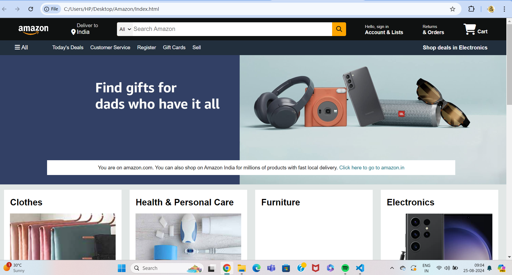
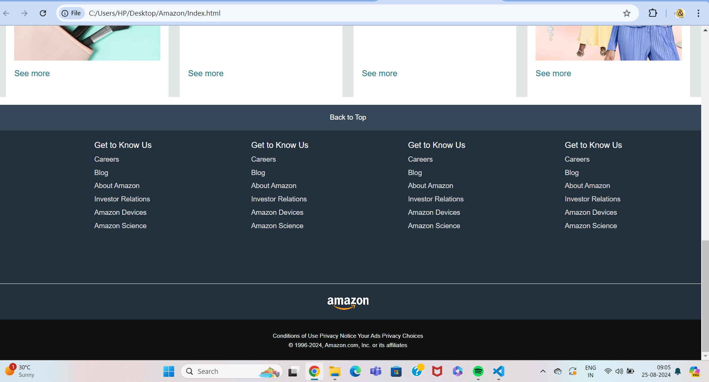

# Amazon-Clone

"Amazon Clone created entirely with HTML and CSS to sharpen my front-end development abilities. This project replicates the visual aesthetics of the Amazon website, focusing on clean, responsive design without relying on JavaScript. Key features include a fully functional navigation bar, product grids, and a visually appealing layout that adapts to different screen sizes. By building this project, I aimed to deepen my understanding of HTML and CSS while achieving a polished and user-friendly interface."

### Author - Mehak Tushar
